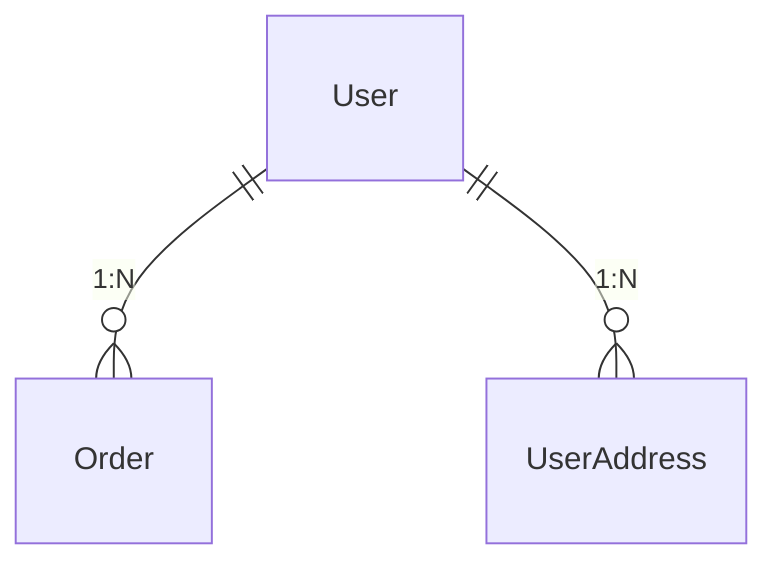
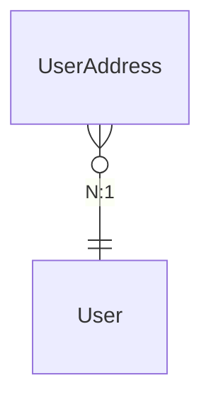
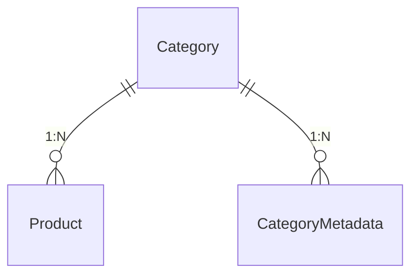
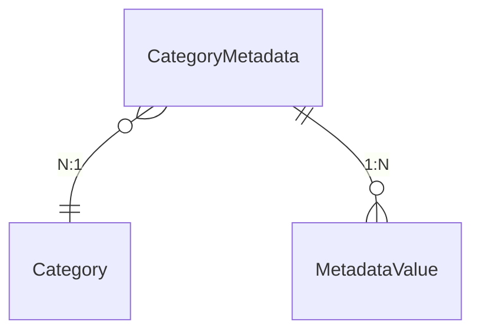
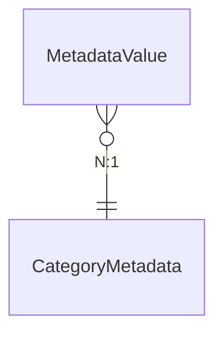
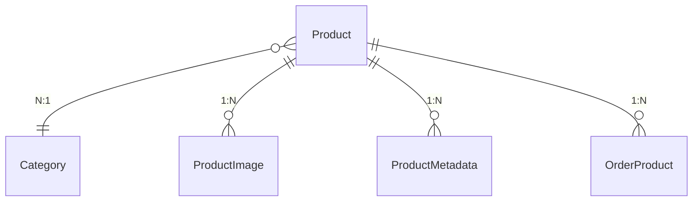
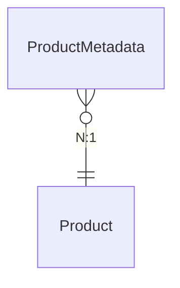
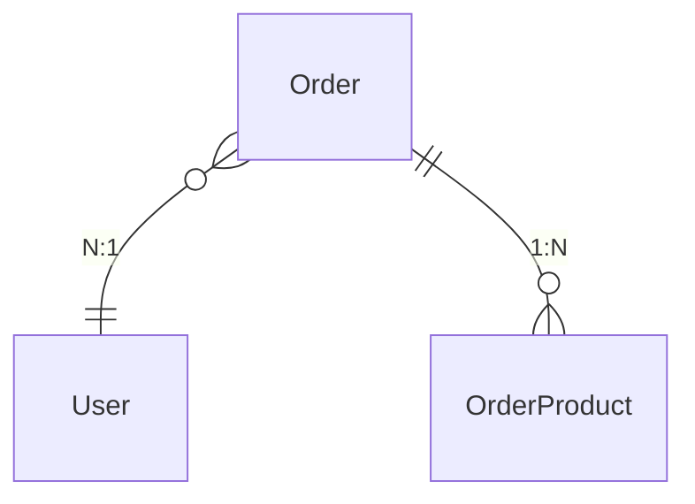
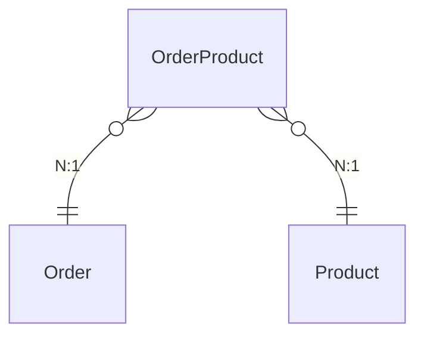
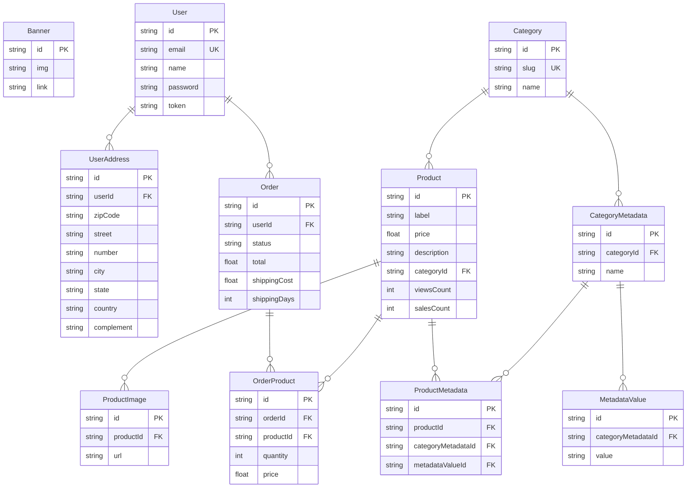

# Banco de Dados B7Store

Sistema de e-commerce com MySQL (MariaDB) via Prisma ORM.

---

## Entidades e Relacionamentos

### User (Usuário)
| Campo | Tipo | Descrição |
|-------|------|-----------|
| id | String (UUID) | PK |
| email | String | Único |
| name | String? | Nome do usuário |
| password | String | Hash bcrypt |
| token | String? | Token de autenticação |

### UserAddress (Endereço do Usuário)
| Campo | Tipo | Descrição |
|-------|------|-----------|
| id | String (UUID) | PK |
| userId | String | FK → User.id |
| zipCode | String | CEP |
| street | String | Logradouro |
| number | String | Número |
| city | String | Cidade |
| state | String | Estado |
| country | String | País |
| complement | String? | Complemento |

### Banner
| Campo | Tipo | Descrição |
|-------|------|-----------|
| id | String (UUID) | PK |
| img | String | Nome do arquivo da imagem |
| link | String? | URL de destino ao clicar |

Tabela independente, sem relacionamentos.

### Category (Categoria)
| Campo | Tipo | Descrição |
|-------|------|-----------|
| id | String (UUID) | PK |
| slug | String | Único, usado em URLs |
| name | String | Nome da categoria |

### CategoryMetadata (Metadado da Categoria)
| Campo | Tipo | Descrição |
|-------|------|-----------|
| id | String (UUID) | PK |
| categoryId | String | FK → Category.id |
| name | String | Nome do atributo (ex: "Marca", "Cor") |

### MetadataValue (Valor do Metadado)
| Campo | Tipo | Descrição |
|-------|------|-----------|
| id | String (UUID) | PK |
| categoryMetadataId | String | FK → CategoryMetadata.id |
| value | String | Valor do atributo (ex: "Apple", "Preto") |

### Product (Produto)
| Campo | Tipo | Descrição |
|-------|------|-----------|
| id | String (UUID) | PK |
| label | String | Nome do produto |
| price | Float | Preço |
| description | String? | Descrição |
| categoryId | String | FK → Category.id |
| viewsCount | Int | Contagem de visualizações |
| salesCount | Int | Quantidade vendida |

### ProductImage (Imagem do Produto)
| Campo | Tipo | Descrição |
|-------|------|-----------|
| id | String (UUID) | PK |
| productId | String | FK → Product.id |
| url | String | Nome do arquivo da imagem |

### ProductMetadata (Metadado do Produto)
| Campo | Tipo | Descrição |
|-------|------|-----------|
| id | String (UUID) | PK |
| productId | String | FK → Product.id |
| categoryMetadataId | String | FK → CategoryMetadata.id |
| metadataValueId | String | FK → MetadataValue.id |

Relaciona um produto a um valor de metadado específico da sua categoria.

### Order (Pedido)
| Campo | Tipo | Descrição |
|-------|------|-----------|
| id | String (UUID) | PK |
| userId | String | FK → User.id |
| status | String | pending / paid / cancelled / shipped / delivered |
| total | Float | Valor total do pedido |
| shippingCost | Float | Frete |
| shippingDays | Int | Prazo de entrega |
| shippingStreet/Number/City/... | String? | Endereço de entrega |

### OrderProduct (Item do Pedido)
| Campo | Tipo | Descrição |
|-------|------|-----------|
| id | String (UUID) | PK |
| orderId | String | FK → Order.id |
| productId | String | FK → Product.id |
| quantity | Int | Quantidade |
| price | Float | Preço unitário no momento da compra |

Tabela pivô entre Order e Product (N:N).

---

## Diagrama Completo

---

## Resumo dos Relacionamentos

| Tipo | Entidade A | Entidade B | Cardinalidade |
|------|-----------|-----------|---------------|
| 1:N | User | Order | Um usuário → vários pedidos |
| 1:N | User | UserAddress | Um usuário → vários endereços |
| 1:N | Category | Product | Uma categoria → vários produtos |
| 1:N | Category | CategoryMetadata | Uma categoria → vários metadados |
| 1:N | CategoryMetadata | MetadataValue | Um metadado → vários valores |
| 1:N | Product | ProductImage | Um produto → várias imagens |
| 1:N | Product | ProductMetadata | Um produto → vários metadados |
| 1:N | Order | OrderProduct | Um pedido → vários itens |
| N:1 | OrderProduct | Product | Vários itens → um produto |
| N:N | Order ↔ Product | via OrderProduct | Muitos-para-muitos |
